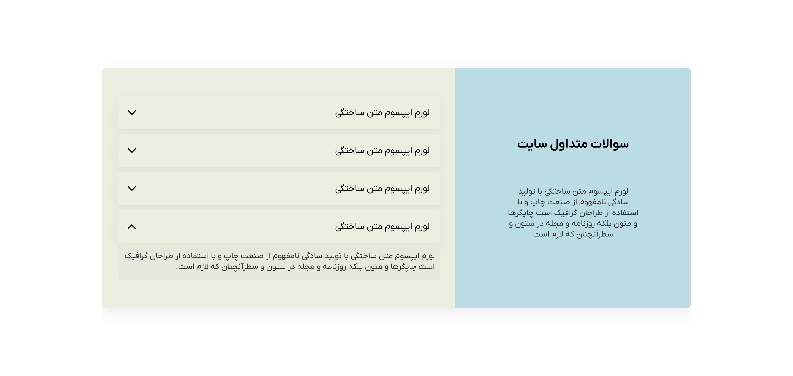
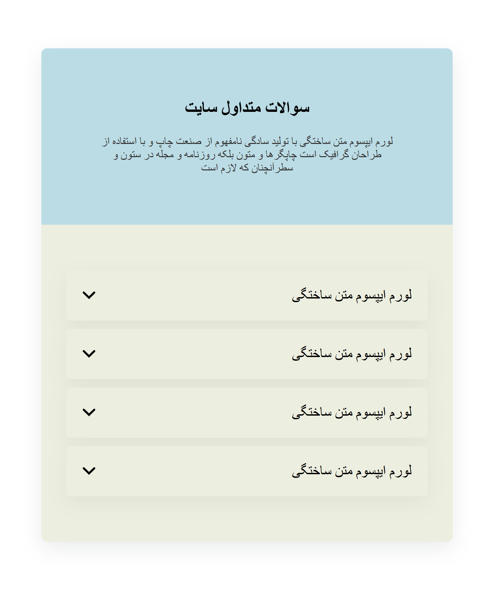

# FAQ Accordion Section | سکشن سوالات متداول (آکاردیونی)

این یک کامپوننت ساده و واکنش‌گرا برای نمایش **سوالات متداول به صورت آکاردیونی** است. با کلیک روی هر سوال، پاسخ نمایش داده می‌شود و سایر آیتم‌ها بسته می‌شوند.

This is a simple and responsive **FAQ Accordion Section**. Clicking on each question will toggle its answer while closing others.

---

## Preview | پیش‌نمایش

 


---

## Features | ویژگی‌ها

- ✅ استایل تمیز و مینیمال
- ✅ فقط با HTML ،CSS و JavaScript پیاده‌سازی شده
- ✅ بستن خودکار سایر آیتم‌ها هنگام باز کردن یکی از سوالات
- ✅ قابل استفاده در هر پروژه وب

---

## How to Use | نحوه استفاده

فقط سه فایل زیر را در پروژه خود قرار دهید:

```bash
index.html
style.css
script.js
```
